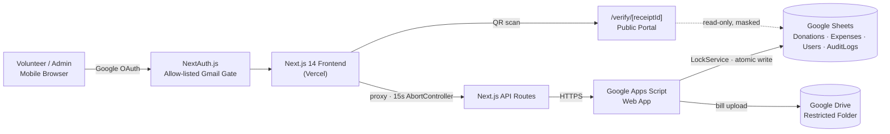

<div align="center">


<br/>

[](https://gpms-ksn.vercel.app)
[](https://nextjs.org/)
[](https://www.typescriptlang.org/)
[](https://tailwindcss.com/)
[](https://www.google.com/sheets/about/)

**A physical receipt book has no audit trail, no backup, and no QR code.**
**GPMS replaces all three — built for one committee, hardened like it serves a thousand.**

</div>

<br/>

## Table of Contents

- [Overview](#overview)
- [Features](#features)
- [Tech Stack](#tech-stack)
- [Architecture](#architecture)
- [Production-Grade Engineering](#production-grade-engineering)
- [Database Schema](#database-schema)
- [Environment Variables](#environment-variables)
- [Getting Started](#getting-started)
- [Public Verification Portal](#public-verification-portal)
- [Roadmap](#roadmap)
- [Author](#author)

<br/>

## Overview

GPMS is a mobile-first web app that digitizes the financial operations — donations and expenses — of a Ganesh Puja Committee. It was purpose-built for a **small, trusted team of 10–15 volunteers and admins** managing roughly **500–1,000 records** per season, not for internet-scale traffic. That constraint is a feature: every decision below optimizes for reliability and auditability over raw throughput.

In the field, a volunteer collects a donation, taps submit, and instantly shares a QR-coded PDF receipt over WhatsApp — no paper, no illegible handwriting, no "I'll enter it later and forget." Every receipt is publicly verifiable, so no one can fake one after the fact.

**Live app:** [gpms-ksn.vercel.app](https://gpms-ksn.vercel.app)

<br/>

## Features

| | |
|---|---|
| 🧾 **Donation Workflow** | Captures donor name, phone, amount, payment mode (Cash/UPI), UPI reference, purpose, and remarks. Generates a `DON-` internal ID and a public `RCT-` receipt ID, then renders an A5 PDF receipt client-side (`jspdf`) with an embedded QR code (`qrcode`) — one tap to share on WhatsApp. |
| 🧮 **Expense Workflow** | Captures category, description, amount, vendor, and a bill upload (image/PDF, max 5MB). The bill is pushed to a restricted Google Drive folder and linked back to the ledger row under a unique `EXP-` ID. |
| 🔐 **Role-Based Access** | **SuperAdmin/Admin** — full control, including cancellations, user management, and audit logs. **Volunteer** — can record donations and expenses in the field, can't cancel or manage users. **Viewer** — read-only. |
| ✅ **Public Verification** | Scanning a receipt's QR code opens `/verify/[receiptId]`, proving the receipt is genuine while masking sensitive fields like the donor's phone number. |

<br/>

## Tech Stack

| Layer | Technology |
|---|---|
| Frontend | Next.js 14+ (App Router), React, Tailwind CSS, Lucide React |
| Auth | NextAuth.js (Auth.js) v5 — Google OAuth, allow-listed Gmail addresses only |
| API layer | Next.js API Routes, acting as a secured proxy |
| Backend | Google Apps Script (GAS) Web App |
| Database | Google Sheets — chosen deliberately for radical transparency; any committee elder can open it and audit every row without touching the app |
| File storage | Google Drive (vendor bill uploads) |
| Hosting | Vercel (frontend) · Google Cloud / Apps Script (backend) |
| PDF & QR | `jspdf`, `qrcode` |

<br/>

## Architecture



The frontend never talks to Google Sheets directly — every write goes through the Apps Script layer, which is the only thing holding the lock and the only thing allowed to touch the spreadsheet.

<br/>

## Production-Grade Engineering

A 500-record community tool doesn't *need* this level of hardening — it has it anyway, because a committee's trust in the ledger is the entire point of building it digital in the first place.

| Real-world problem | Engineering solution |
|---|---|
| Bad mobile signal in a crowd → volunteer double-taps "Submit" | Client generates a `crypto.randomUUID()` transaction ID that survives network timeouts; the backend rejects any row with a duplicate ID |
| Two volunteers submit at the same instant → race condition on sequential IDs | `LockService.getScriptLock()` wraps ID generation and row insertion in one atomic, 15-second-timeout transaction |
| Bill uploads to Drive, then the Sheets write fails | The (slow) Drive upload happens *outside* the lock for speed; on a failed or duplicate insert, the orphaned Drive file is automatically trashed — no storage leaks |
| Google's servers stall mid-request | Every proxied API call is wrapped in a 15-second `AbortController` so the UI degrades gracefully instead of hanging |
| Malformed or absurd amounts corrupt the ledger | Server-side validation hard-caps every amount between ₹1 and ₹9,999,999 |

<br/>

## Database Schema

Google Sheets serves as the database, with the backend relying on exact 0-indexed column positions.

<details>
<summary><strong>Donations Sheet</strong></summary>
<br/>

`Donation ID` · `Receipt ID` · `Donor Name` · `Phone` · `Amount` · `Payment Mode` · `UPI Ref` · `Collector ID` · `Collector Name` · `Purpose` · `Remarks` · `Status (Active/Cancelled)` · `Created At` · `Updated At` · `Transaction ID`

</details>

<details>
<summary><strong>Expenses Sheet</strong></summary>
<br/>

`Expense ID` · `Category` · `Description` · `Vendor` · `Amount` · `Paid By ID` · `Paid By Name` · `Bill Link` · `Status (Active/Cancelled)` · `Created At` · `Updated At` · `Transaction ID`

</details>

<details>
<summary><strong>Supporting sheets</strong></summary>
<br/>

`Users` · `Settings` (holds Drive folder IDs) · `Categories` · `AuditLogs` · `Metadata` (ID sequence counters) · `Sessions`

</details>

<br/>

## Environment Variables

<details>
<summary><strong>Vercel (frontend)</strong></summary>
<br/>

| Variable | Purpose |
|---|---|
| `NEXT_PUBLIC_API_URL` | Deployed Apps Script Web App URL |
| `AUTH_GOOGLE_ID` | Google OAuth client ID |
| `AUTH_GOOGLE_SECRET` | Google OAuth client secret |
| `AUTH_SECRET` | NextAuth.js encryption key |
| `AUTH_URL` | Production Vercel domain |

</details>

<details>
<summary><strong>Apps Script (backend)</strong></summary>
<br/>

Deployed to execute **as "Me"** (the admin account) with access set to **"Anyone."** The Google Sheet ID is held in `Config.gs`, not in an env file.

</details>

<br/>

## Getting Started

```bash
# 1. Clone
git clone https://github.com/TechGenDM/<repo-name>.git
cd <repo-name>

# 2. Install
npm install

# 3. Configure — add the Vercel variables above to a .env.local
cp .env.example .env.local

# 4. Run locally
npm run dev
```

For the backend, deploy `Config.gs` and the rest of the Apps Script project from the Google Sheet's **Extensions → Apps Script** menu, execute as *Me*, set access to *Anyone*, then copy the resulting Web App URL into `NEXT_PUBLIC_API_URL`.

<br/>

## Public Verification Portal


Every printed or shared receipt carries a QR code. Scanning it opens a public, read-only page at `/verify/[receiptId]` that confirms the receipt is genuine — while quietly masking sensitive fields like the donor's phone number. No login required, nothing to fake: the seal on the receipt matches the seal in the ledger, or it doesn't exist.

<br clear="left"/>

<br/>

## Roadmap

Ideas under consideration for future seasons — not commitments:

- [ ] SMS/WhatsApp receipt delivery without opening the app
- [ ] Season-over-season donor history lookup
- [ ] CSV export for the committee's annual report
- [ ] Offline-first submission queue for zero-signal collection points

<br/>

## Author

**Devasish Mishra** · *"I was built to build."*

[](https://github.com/TechGenDM)
[](https://www.linkedin.com/in/devasish-mishra-62546a34a)

CS & AI student, Scaler School of Technology + BITS Pilani.

<br/>

<div align="center">

*This project is built for one community's trust — not for the internet's traffic.*

**Ganpati Bappa Morya 🙏**

</div>
